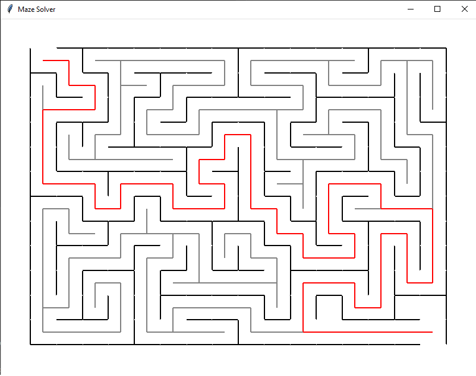

# Python Maze Solver

## Description

Using Python and Tkinter to build a GUI that solves mazes. The code draws a randomized maze and then systematically solves it.

## Technologies Used

- **Backend**:

  - Native Python (Requires at least version 3.3)
  - Tkinter library

- **Deployment**:

  - No deployment required, simply execute the main.py script.

## Try my app

1. You can try the app by cloning the repo locally, make sure you have python3 installed as well as the Tkinter library. Simply clone and run the script in main.py

## Visual reference of project

The following image demonstrates the app's appearance:

## License

This project uses the MIT license.
